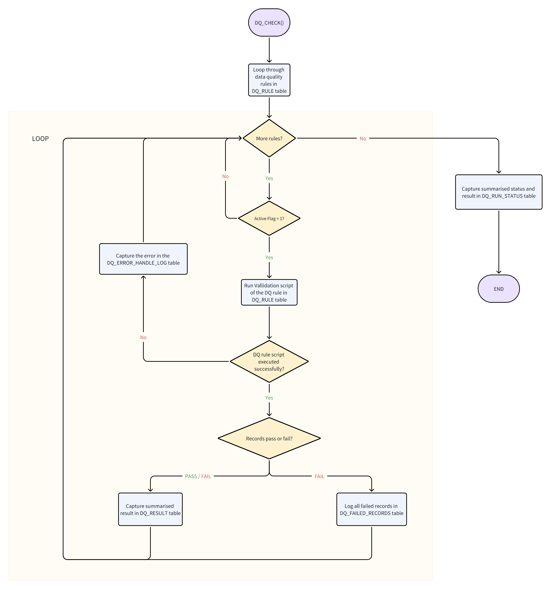

# Data Quality Framework Documentation

## 1. Introduction

The Data Quality Automation Framework is designed to ensure the quality and integrity of data within our organization's databases. It provides a systematic approach to defining, executing, and monitoring data quality rules across various data sources.

## 2. Components

### 2.1. DQ_RULE Table

The `DQ_RULE` table stores metadata about data quality rules defined within the framework, that needs to be applied to the data. It includes information such as the rule category, severity, description, validation script, and timestamps for creation and updates.

### 2.2. DQ_RESULT Table

The `DQ_RESULT` table records the results of data quality checks performed by the framework. It captures metrics such as the count of passed and failed checks, percentage of failed checks, and timestamps.

### 2.3. DQ_FAILED_RECORDS Table

The `DQ_FAILED_RECORDS` table logs errors encountered during data quality checks. It provides details such as the affected rule, subject area, database, schema, table, column, column value, primary key and key values, result, description, audit timestamp, and PII flag.

### 2.4. DQ_RUN_STATUS Table

The `DQ_RUN_STATUS` table keeps track of the overall status of the data quality rule executions.

### 2.5. DQ_ERROR_HANDLE_LOG Table

The `DQ_ERROR_HANDLE_LOG` table logs any errors with the arrow rules ideas encountered during the data quality execution process.

### 2.6. DQ_CHECK()

The stored procedure is designed to automate the execution of data qualit rules check defined in the DQ_RULE table. It validates the data according to the rules.

### 2.7. Data Quality Dashboard

The Data Quality Dashboard provides a visual representation of data quality metrics and trends. It offers insights into the overall health of data quality across different dimensions such as rule adherence, error rates, and compliance levels.

## 3. Details

### DQ_RULE Table

The table is designed to be the core component of our data quality automation framework. It is built to be scalable and flexible, allowing the addition of various types of rules to ensure comprehensive data validation and quality management.

- The table structure allows for the addition of an unlimited number of rules. New rules can be easily integrated without requiring changes to the table schema.
- Rule type is implemented used as an identifier in the DQ stored procedure to process differently.
  - Type 1 means executing the validation script as "where" clauses.
  - Type 2 means direct execution.
- The table includes a column of rule severity to categorize the impact of each rule.
- Each rule has an active flag to indicate whether the rule is currently active or inactive. This allows for easy enabling or disabling of the rule to be executed in the stored procedure as needed.

#### Columns

| Column Name            | Column Description                                                                                               | Comment                             |
|------------------------|---------------------------------------------------------------------------------------------------------------|-------------------------------------|
| DQ_RULE_ID             | Unique identifier of DQ rule which is automatically (sequentially) generated.                                    | Primary Key                         |
| SUBJECT_AREA           | Subject area                                                                                                    |                                     |
| DATABASE_NAME          | Database name                                                                                                   |                 |
| SCHEMA_NAME            | Schema name                                                                                                     |                                     |
| TABLE_NAME             | Table name where the data rule is implemented                                                                   |                                     |
| COLUMN_NAME            | Column name/names where the data rule is implemented                                                            |                                     |
| PRIMARY_KEY_COLUMN     | Primary key name/names of the table                                                                             |                                     |
| RULE_CATEGORY          | Indicates if the rule is mandatory or non-mandatory                                                             |                                     |
| RULE_THRESHOLD         | Determines the maximum allowable percentage of errors before a rule is considered failed.                       |                                     |
| RULE_SEVERITY          | Shows the impact of a rule violation and prioritizes the resolution of issues based on their severity.           |                                     |
| RULE_DESCRIPTION       | Detailed description of the rule                                                                                |                                     |
| RULE_VALIDATION_SCRIPT | For RULE_TYPE = 1, validation script as "where" clause.                                                         | `SELECT * FROM SCHEMA_NAME.TABLE_NAME WHERE (RULE_VALIDATION_SCRIPT)` |
| CREATED_TIMESTAMP      | Rule creation datetime                                                                                          |                                     |
| UPDATED_TIMESTAMP      | Rule updated datetime                                                                                           | Not implemented yet (may require stream and task in Snowflake) |
| DQ_ACTIVE_FG           | Indicates if the rule is active or inactive. `1` - active, `0` - inactive                                       |                                     |
| RULE_TYPE              | Rule type identifier in DQ stored procedure to process differently, types: 1 or 2.                              |      |
| PII_FLAG               | If the column is PII. In the failed record table, the column value of this rule will be masked|                                     |

---

### DQ_RESULT Table

This table captures the outcomes of various data quality checks. It helps track the success or failure of each executed rule, providing a clear picture of the success and failure ratio of these rules and enabling us to filter out the ones needing attention.

- Keeps a log of data quality checks to monitor the health of the dataset over time.
- Enables analysis of data quality trends and identification of recurring issues.

#### Columns

| Column Name         | Column Description                                                                                              | Comment                               |
|---------------------|--------------------------------------------------------------------------------------------------------------|---------------------------------------|
| DQ_RESULT_ID        | Unique identifier of the DQ result which is automatically (sequentially) generated                              | Primary Key                           |
| DQ_RULE_ID          | Unique identifier of the DQ rule                                                                               | Foreign Key                           |
| DQ_JOB_ID           | Unique identifier, an automated sequential number is generated every time the DQ_CHECK procedure is run        |                                       |
| SUBJECT_AREA        | Subject area                                                                                                   |                   |
| DATABASE_NAME       | Database name                                                                                                  |                                       |
| SCHEMA_NAME         | Schema name                                                                                                    |                                       |
| TABLE_NAME          | Table name where the data rule is implemented                                                                  |                                       |
| COLUMN_NAME         | Column name where the data rule is implemented                                                                 |                                       |
| DQ_RESULT           | Data quality result: `Pass`, `Below Threshold`, or `Fail`                                                      | `Pass`: 100% of records passed;
`Below Threshold`: Failed records within threshold percentage;
`Fail`: Failed records above threshold percentage. |
| RULE_SEVERITY       | Shows the impact of a rule violation and prioritizes the resolution of issues based on their severity.          |                                       |
| RULE_DESCRIPTION    | Detailed description of the rule                                                                               |                                       |
| RULE_THRESHOLD      | Determines the maximum allowable percentage of errors before a rule is considered failed.                      |                                       |
| COUNT_OF_PASSED     | Count of how many rows passed the data quality rule                                                            |                                       |
| COUNT_OF_FAILED     | Count of how many rows failed the data quality rule                                                            |                                       |
| PCT_OF_FAILED       | Percentage of how many rows failed the data quality rule                                                       |                                       |
| PCT_OF_PASSED       | Percentage of how many rows passed the data quality rule                                                       |                                       |
| DQ_RUN_TIMESTAMP    | The date timestamp when the current DQ rule was executed                                                       |                                       |

---

### DQ_FAILED_RECORDS Table

This table captures the records that do not meet the defined data quality rules. It pinpoints specific data issues and facilitates their resolution.

- Comprehensively lists the records that failed to pass the DQ rule, helping the business understand and triage the data for remediation.
- Capable of managing rules that involve tables with multiple primary keys and records all primary key names and values in the table.
- Failure data can be grouped to understand trends and patterns.

#### Columns

| Column Name        | Column Description                                                                                             | Comment                   |
|--------------------|-------------------------------------------------------------------------------------------------------------|---------------------------|
| DQ_AUDIT_ID        | Unique identifier which is automatically generated.                                                            | Primary Key               |
| DQ_RULE_ID         | Unique identifier of the DQ rule                                                                               | Foreign Key               |
| DQ_JOB_ID          | Unique identifier, an automated sequential number is generated every time the DQ_CHECK procedure is run       |                           |
| SUBJECT_AREA       | Subject area                                                                                                  |       |
| DATABASE_NAME      | Database name                                                                                                 |                           |
| SCHEMA_NAME        | Schema name                                                                                                   |                           |
| TABLE_NAME         | Table name where the data rule is implemented                                                                 |                           |
| COLUMN_NAME        | Column name where the data rule is implemented                                                                |                           |
| COLUMN_VALUE       | The value of the column                                                                                       |                           |
| PRIMARY_KEY_NAME   | Contains primary key column name/names                                                                        |                           |
| PRIMARY_KEY_VALUE  | Contains value/values of the primary key column/columns                                                       |                           |
| DQ_RESULT          | `FAIL`, only failed records are recorded                                                                      |                           |
| RULE_SEVERITY      | Shows the impact of a rule violation and prioritizes the resolution of issues based on their severity.          |                           |
| RULE_DESCRIPTION   | Detailed description of the rule                                                                              |                           |
| DQ_RUN_TIMESTAMP   | DQ run timestamp when it executes the current data quality rule                                               |                           |
| PII_FLAG           | If the column is PII. `Y` - Yes, `N` - No. In the failed record table, the column value of this rule will be masked (not applied yet) |                           |

---

### DQ_RUN_STATUS Table

This table serves to track and record the status of each data quality run. It provides essential information for monitoring, auditing, and troubleshooting data quality processes.

- Enables traceability and context for each DQ_CHECK execution.
- Used to generate email notifications for internal use.

#### Columns

| Column Name          | Column Description                                                                                          | Comment                           |
|----------------------|----------------------------------------------------------------------------------------------------------|-----------------------------------|
| DQ_JOB_ID            | Unique identifier, an automated sequential number is generated every time the DQ_CHECK procedure is run    |                                   |
| DQ_RUN_STATUS        | DQ run status, completed successfully or completed with error                                               |                                   |
| EXPECTED_DQ_RUN_COUNT| Count of rules going to be checked on                                                                       |                                   |
| ACTUAL_DQ_RUN_COUNT  | Count of rules executed in the current job                                                                  |                                   |
| ACTUAL_DQ_PASS_COUNT | Count of passed rules in the current job                                                                    |                                   |
| ACTUAL_DQ_FAIL_COUNT | Count of failed rules in the current job                                                                    |                                   |
| DQ_RUN_TIMESTAMP     | DQ run timestamp of the current job                                                                         |                                   |

---

### DQ_ERROR_HANDLE_LOG Table

This table stores detailed information about errors (e.g., SQL compilation) encountered during rule execution. It captures error messages and associated RULE_ID to facilitate troubleshooting and resolution of failed rule executions.

- Supports root cause analysis by capturing the system error message in the column `ERR_MESSAGE`.

#### Columns

| Column Name    | Column Description                                                                                           | Comment                         |
|----------------|-----------------------------------------------------------------------------------------------------------|---------------------------------|
| DQ_JOB_ID      | Unique identifier, an automated sequential number is generated every time the DQ_CHECK procedure is run    | Foreign Key                     |
| ERR_D_RULE_ID  | Unique identifier of the DQ rule ID which has an error and failed to be executed                            |                                 |
| ERR_MESSAGE    | System message with error code and error message                                                           |                                 |
| DQ_RUN_TIMESTAMP| DQ run timestamp when it executes the current data quality rule                                            |                                 |

---

### DQ_CHECK Stored Procedure

The stored procedure is the cornerstone of the data quality automation framework. It is responsible for executing all active data quality rules defined in the DQ_RULE table. Designed to handle complex scenarios, the procedure ensures thorough data validation, supports different rule types, and provides robust error handling and logging. It also tracks the status of each run to facilitate monitoring and auditing.

- Automatically constructs the validation queries based on the type of rule.
- Validates quality conditions.
- Tracks the status of each run and captures relevant error details for quick identification and resolution of issues.
- Captures summarized results in DQ_RESULT for a quick snapshot view for management.

---

*Note: Some features such as `UPDATED_TIMESTAMP` and `PII_FLAG` are not yet implemented.*

## 4. Maintenance

- Regularly review and update data quality rules based on evolving data requirements and business needs.
- Monitor and optimize the performance of data quality checks to ensure timely execution.
- Periodically review and clean up historical data in the `DQ_FAILED_RECORDS` tables to manage storage resources.

## 54. Conclusion

The Data Quality Automation Framework, coupled with the Data Quality Dashboard, plays a critical role in maintaining the quality and integrity of our organization's data. By defining, executing, and monitoring data quality rules and metrics, we ensure that our data remains accurate, consistent, and reliable for decision-making processes.
